# 3D iBMS — 智慧建築監控管理平台

> AI-DT Enterprise · 3D 數位孿生 × 智慧設施管理

即時 3D 場景監控、AI 根因分析、BIM 整合、能源管理與工單維運的全方位智慧建築管理平台。

---

## 畫面截圖

| 登入頁面 | 主畫面（Admin，側邊欄展開） |
|---|---|
| 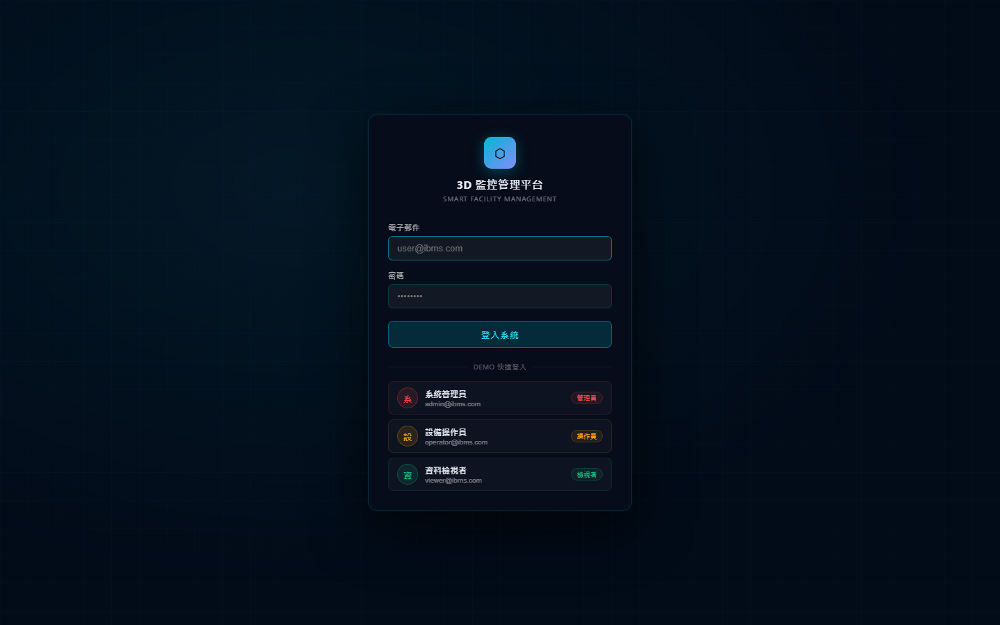 | 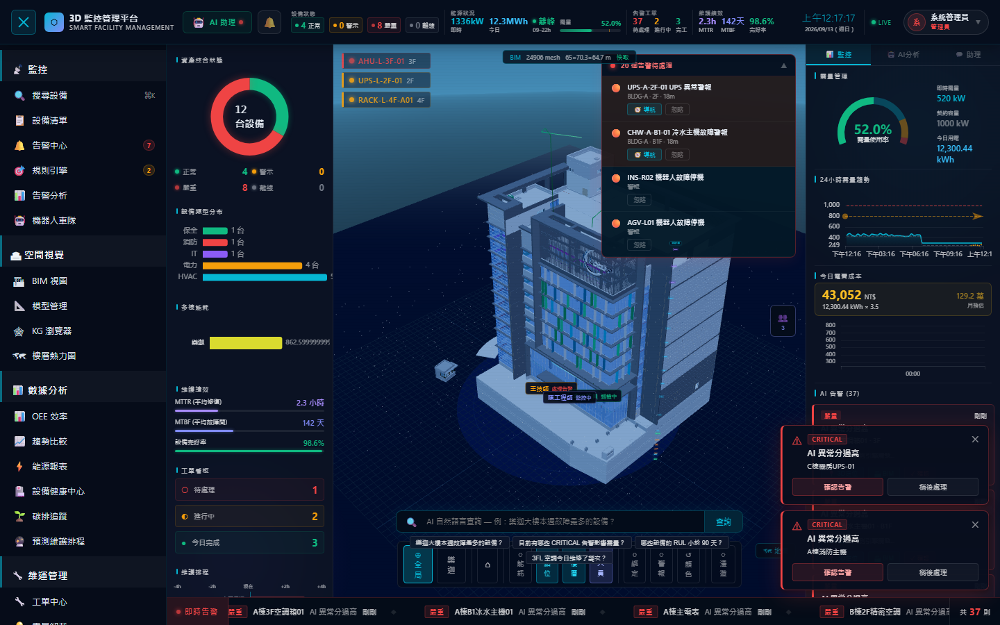 |

| 側邊欄收合 | AI 助理面板 |
|---|---|
| 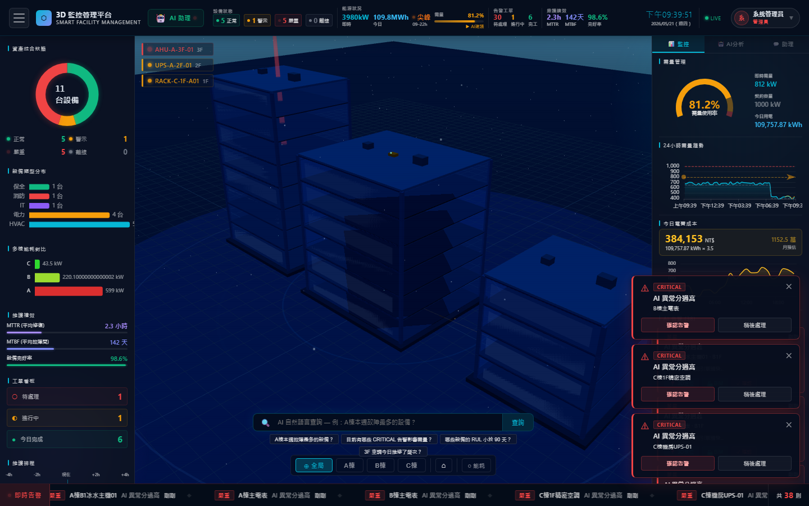 | 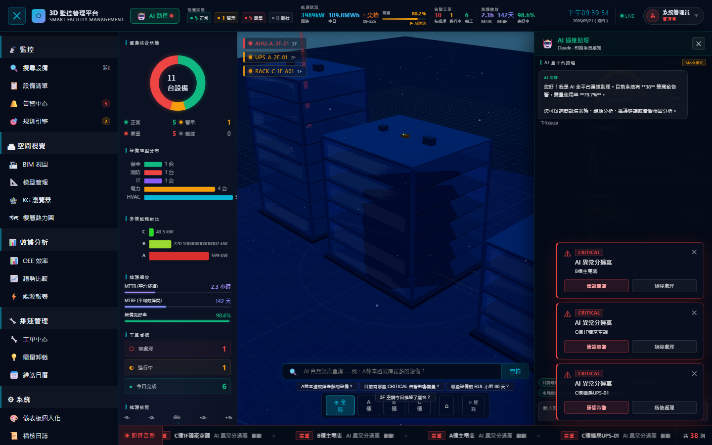 |

| Navbar KPI 列 | 使用者選單 |
|---|---|
|  | 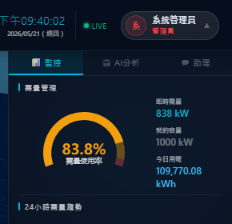 |

| 側邊欄（Admin — 全部解鎖） | 側邊欄（Viewer — 部分鎖定） |
|---|---|
| 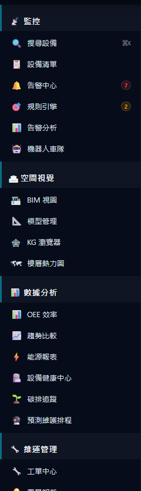 | 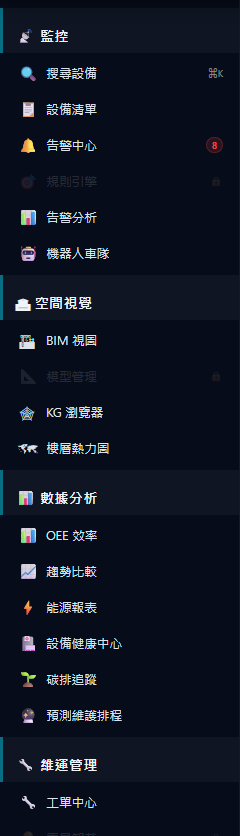 |

| 設備抽屜 — 概覽 | 設備抽屜 — 孿生診斷 |
|---|---|
| 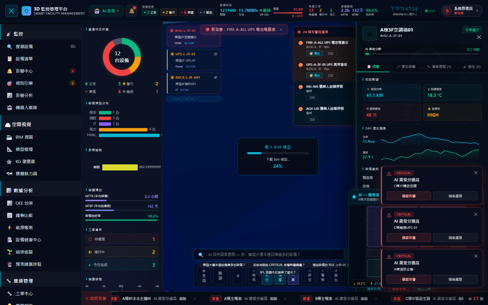 | 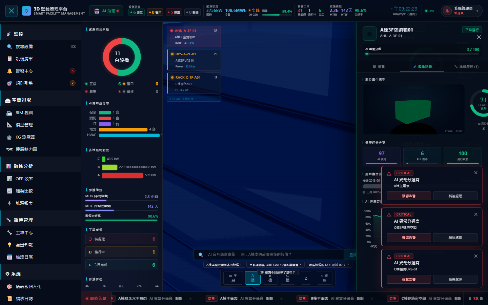 |

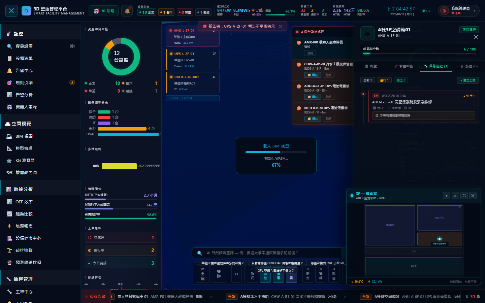

| 能源報表（Excel / PDF 匯出） |
|---|
| 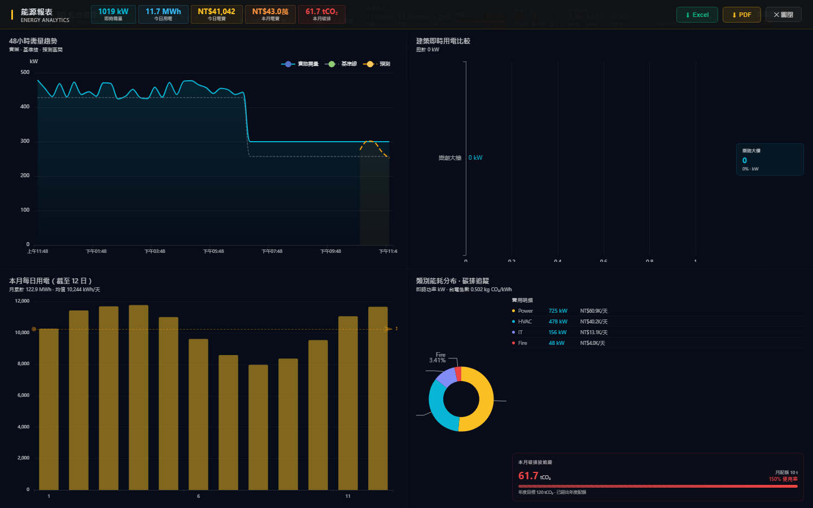 |

| 設備清單 | 設備履歷護照（QR Code / AI 健康趨勢 / PDF 匯出） |
|---|---|
| 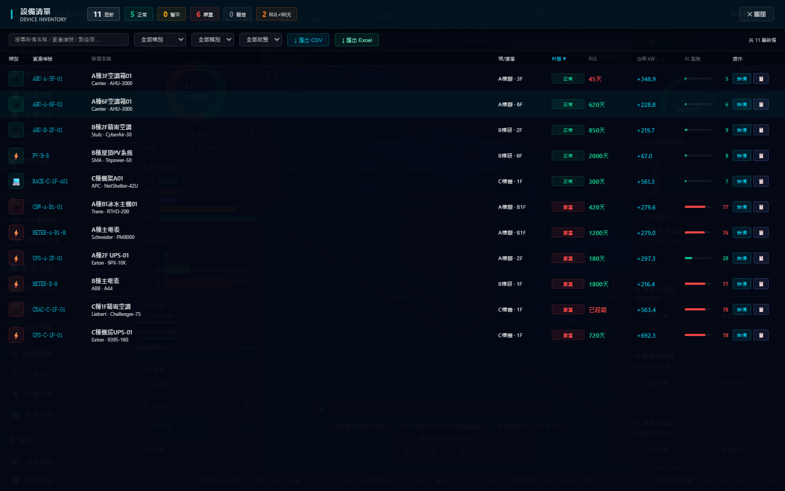 | 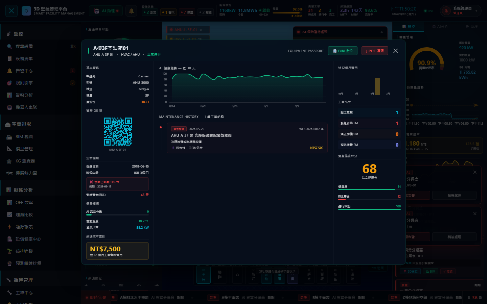 |

---

## 功能概覽

### 佈局
- **AppShell**：64px Navbar（KPI 列 + 時鐘 + 連線狀態）+ 可折疊左側邊欄
- **側邊欄 5 大分類**：監控 / 空間視覺 / 數據分析 / 維運管理 / 系統

### 監控
| 功能 | 說明 |
|------|------|
| 3D 場景 | Three.js 即時設備狀態視覺化，支援飛越相機、脈衝環、粒子流 |
| 設備詳情 | 側拉抽屜，顯示功率、溫度、AI 異常分數、歷史趨勢 |
| 設備清單 | 表格檢視，支援篩選、排序、設備履歷跳轉 |
| 全域搜尋 | `Ctrl+K` 快速搜尋設備與告警 |
| 告警中心 | 分級告警管理（CRITICAL / ALARM / WARNING / INFO） |
| 即時跑馬燈 | 底部告警無縫捲動，速度可調 |
| AMR / AGV 車隊 | 自主移動機器人即時位置追蹤（10 Hz 遙測、平滑插值、軌跡殘影、跟隨/機載視角）→ 見下方專節 |

### AI 功能
| 功能 | 入口 | 說明 |
|------|------|------|
| **AI 運維助理** | Navbar 🤖 按鈕 | 全平台對話式 AI，具備即時系統上下文（設備狀態、告警、KPI、高風險設備 Top 5），可詢問根因分析、維護建議、能源優化。支援 Claude API（設定 API Key 後）或內建 Mock 模式 |
| AI 根因分析 | 自動觸發 | CRITICAL 告警自動呼叫 Claude API，產生 50 字內根因說明並顯示於告警詳情 |
| 自然語言查詢 | 場景底部 NL Bar | 輸入中文查詢設備狀態、告警、能源數據 |
| AI 需量卸載 | 需量進度條點擊 | 超過契約警戒線時，AI 自動建議設備卸載優先順序 |

#### AI 運維助理使用說明

1. 點擊 Navbar 左側 **🤖 AI 助理** 按鈕，右側滑入聊天面板
2. 有 CRITICAL 告警時按鈕出現**紅色脈衝點**提醒
3. 面板頂部顯示當前模式：`Claude API`（已設定金鑰）或 `Mock 模式`（預設）
4. 前往「系統設定 → Claude 設定」輸入 Anthropic API Key 啟用完整 AI 功能

**可詢問範例：**
```
目前哪些設備最需要立即維修？
今日用電為什麼偏高？
冷卻塔 CT-01 的異常原因是什麼？
建議我如何降低需量以避免超約？
```

### 空間視覺
- **BIM 視圖**：IFC 模型載入、設備定位、元件高亮
- **模型管理**：多棟 IFC 模型切換與可見性控制
- **KG 瀏覽器**：設備知識圖譜拓撲視覺化
- **樓層熱力圖**：2D 俯視告警 / 功率 / RUL 熱力疊加

### 數據分析
- **OEE 效率儀表板**：可用率、效率、品質三率趨勢
- **趨勢比較**：多設備歷史數據疊加對比
- **能源報表**：日/月用電、電費試算、峰谷分析、Excel/PDF 匯出（Phase 11）

### 維運管理
- **工單中心**：CRUD、狀態追蹤（待指派 → 處理中 → 完成）
- **維護日曆**：月曆視圖，工單排程視覺化
- **需量卸載**：AI 卸載計畫面板（需後端連線）
- **規則引擎**：自訂告警規則，支援 AND/OR 條件

### 能源報表匯出（Phase 11）

| 能源報表（含匯出按鈕） |
|---|
|  |

| 功能 | 說明 |
|------|------|
| **Excel 匯出** | 5 個工作表：KPI彙總 / 建築用電 / 類別能耗 / 每日用電 / 48h需量趨勢（峰谷標註），完整中文標頭與公式欄位 |
| **PDF 匯出** | 專屬排版容器（含即時 KPI 標題列 + 4 圖表區域），html2canvas 2×縮放後輸出 A4 橫式 PDF |
| **按鈕狀態** | 匯出中顯示 loading，兩個按鈕互鎖避免重複觸發 |

### AMR / AGV 機器人即時追蹤

依《3D 監控管理平台自主移動機器人（AMR/AGV）即時動態位置顯示模組規劃設計規格書 V1.0.0》
（`docs/3D_Monitoring_Robot_Tracking_Module_Specification.md`）實作，側邊欄 **監控 → 🤖 機器人車隊**。

| 規格章節 | 實作 |
|---|---|
| §4.1 通訊 | 沿用既有 WebSocket 通道，後端以 10 Hz 批次推播 `robot_telemetry`（可用 `ROBOT_TELEMETRY_HZ` 調整為 10~15 Hz） |
| §4.2 封包 | `ROBOT_TELEMETRY` schema（pose / motion / status），另提供 `POST /api/robots/telemetry` 供 MQTT / ROSBridge 閘道注入真實遙測 |
| §5 坐標校準 | ROS(z-up) → Three(y-up) 軸向轉換 + Yaw + 均勻縮放 + 平移，組成 4×4 `M_align`；參數存於 `backend/calibration_profiles.json`，依 mtime 熱加載 |
| §5.3 現場標定 | 面板「坐標校準」頁可編輯錨點並最小平方求解（Umeyama 水平封閉解），輸出 RMSE 與逐點殘差，達標（≤ 0.15 m）才允許寫入 |
| §6.2 平滑插值 | 位置 LERP、朝向 SLERP，皆採指數衰減阻尼 `α = 1 − e^(−12Δt)`，幀率浮動下收斂時間一致 |
| §6.3 HUD | 車體上方 3D 看板（車號 / 電量條 / 狀態 / 速度）＋ 底盤呼吸光環，`alarm_level = 2` 時轉為紅色高頻閃爍 |
| §6.4 軌跡殘影 | BufferGeometry 動態頂點，位移 ≥ 0.3 m 新增一點、上限 200 點，顏色由尾端漸暗 |
| §7 視角 | 全局概覽（OrbitControls）／鎖定跟隨（車體後上方彈簧臂）／第一人稱（機載視角）＋ 樓層過濾 |
| §8.1 效能 | 距離 LOD（>50 m 光點、15~50 m 精簡車體、<15 m 完整細節）＋ 視錐體剔除後才渲染 HUD |
| §8.2 容錯 | 心跳逾時 3 秒 → `SIGNAL_LOST` 半透明 Ghost；瞬時速度 > 3.5 m/s 判定定位漂移並捨棄該幀（以採樣時間戳計算，避免訊息批次到達誤判） |
| 告警聯動 | 機器人故障停機（`alarm_level = 2`）自動產生 ALARM 告警，進入既有告警中心 / 跑馬燈 / 通知流程 |

樓板高程解析順序：已載入的 IFC 實際樓層 → 校準 profile 的 `floor_elevations` → 內建預設表。
後端未連線時，前端以相同路線與狀態機在本地模擬 6 台車（後端遙測恢復後自動讓位）。

| 車隊監控面板 | 坐標校準（錨點求解） |
|---|---|
| 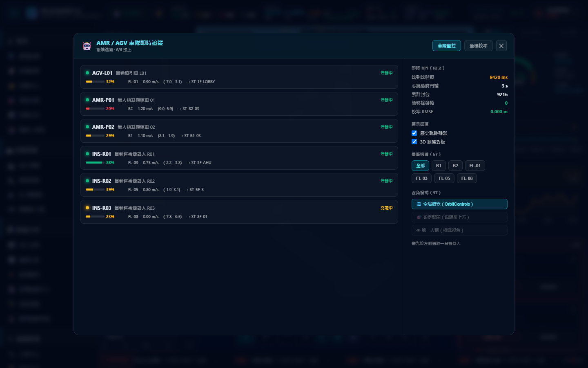 | 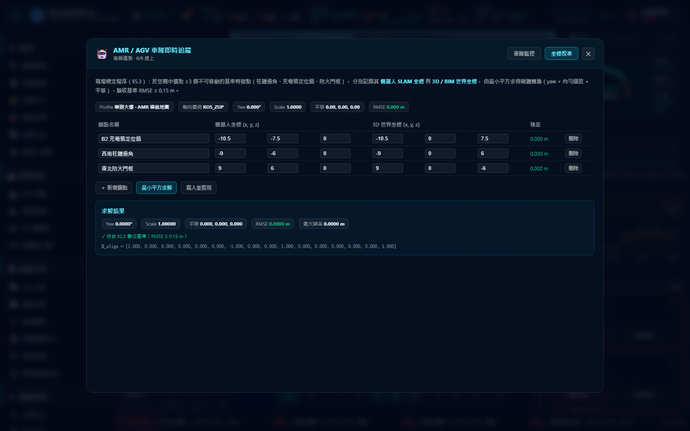 |

| 鎖定跟隨視角 | 3D 場景 |
|---|---|
| 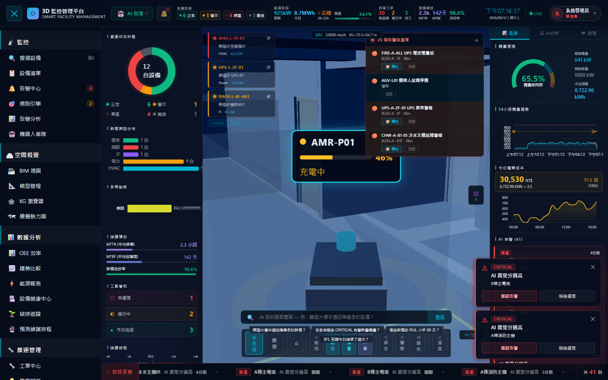 | 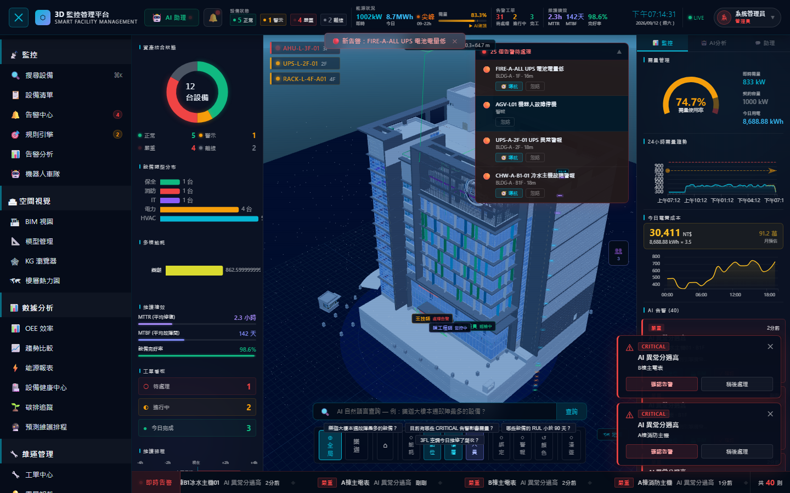 |

### 設備詳情抽屜（Phase 10 — 數位孿生名片）
點擊任何設備後，右側滑出強化版詳情抽屜，分三個 Tab：

| Tab | 內容 |
|-----|------|
| **概覽** | 即時數據（功率/溫度/RUL/重要性）、24h 歷史趨勢迷你圖、設備資訊、BIM 定位、遠端控制 |
| **孿生診斷** | 互動式 3D 設備模型（WebGL）、健康評分環圖（AI偵測 + RUL + 狀態）、剩餘壽命時間軸、AI 健康衰退預測曲線（含警戒/危急閾值） |
| **維修歷程** | 工單垂直時間軸（EM/CM/PM 色分、派工人員、AI 根因）、快速建立工單 |

### 驗證 & 存取控制（Phase 7）
| 角色 | 說明 | 可存取功能數 |
|------|------|------|
| **系統管理員** | 完整存取所有功能 | 17 / 17 |
| **設備操作員** | 操作管理功能，無稽核日誌與系統設定 | 15 / 17 |
| **資料檢視者** | 唯讀模式，受限於監控與分析 | 11 / 17 |

- **登入頁面**：表單登入 + DEMO 快速登入三個角色
- **Session 持久化**：localStorage（8 小時 TTL）
- **RBAC**：Sidebar 項目依角色自動上鎖（🔒），無法點擊
- **使用者選單**：Navbar 右側顯示目前使用者，支援登出

### 系統
- **儀表板個人化**：KPI 顯示項目開關、左右面板切換
- **稽核日誌**：操作歷史查詢（需後端連線）
- **系統設定**：能源參數、告警音效、桌面推播、Webhook 推送、Claude API 金鑰
- **設備履歷護照**（Phase 12）：QR Code 資產識別、30 天 AI 健康趨勢圖表、真實工單費用累計（EM/CM/PM 時薪計算）、PDF 護照一鍵匯出

---

## 效能（Phase 13 優化後）

| 指標 | 優化前 | 優化後 | 改善 |
|------|--------|--------|------|
| 初始 JS bundle（gzip） | 1,120 kB | **44 kB** | **-96%** |
| 初始 JS bundle（raw） | 3,647 kB | **139 kB** | **-96%** |
| 首屏需下載模組 | 全部元件 | App shell 只 | 按需載入 |
| PWA 離線支援 | ✗ | ✅ Service Worker | — |
| 可安裝至桌面 | ✗ | ✅ Web App Manifest | — |

**Code-split 策略：**
- 19 個 Modal 元件 → 各自獨立 chunk（5–39 kB），首次開啟才下載
- `vendor-export`（xlsx + jspdf + html2canvas，877 kB）→ 僅在匯出功能使用時載入
- `vendor-three`（960 kB）、`vendor-echarts`（1,052 kB）→ 獨立快取，版本升級不破壞其他 chunk 快取

---

## 技術棧

**前端**
- React 18 + TypeScript + Vite 5
- Three.js / `@react-three/fiber` — 3D 場景
- `@thatopen/components` + `web-ifc` — IFC / BIM 解析
- ECharts 5 (`echarts-for-react`) — 圖表
- framer-motion — 動畫
- `@xyflow/react` — 知識圖譜
- Anthropic SDK — Claude AI 整合
- `vite-plugin-pwa` + Workbox — PWA / Service Worker

**後端**（選配，Phase 14）
- Python 3.10+ + FastAPI 0.115+ + Uvicorn — REST + WebSocket
- WebSocket 即時資料推送（snapshot / device_update / kpi_update / alert_new / workorder_new）
- 模擬 IoT 資料產生器（每秒功率/溫度波動、10 秒狀態切換、25 秒告警生成）
- 完整 REST API：裝置、告警、工單、能源、稽核日誌
- Python 3.14 相容（pydantic >= 2.10）

---

## 快速開始

### 前端

```bash
# 安裝依賴
npm install

# 啟動開發伺服器（port 5173）
npm run dev

# 建置
npm run build
```

### 後端（選配，啟用後切換為 LIVE 模式）

```bash
cd backend
pip install -r requirements.txt   # 需 Python 3.10+
python -m uvicorn main:app --host 0.0.0.0 --port 8000
# 或 Windows：
start.bat
```

後端預設監聽 `http://localhost:8000`，文件在 `http://localhost:8000/docs`。  
前端自動偵測連線狀態（Navbar 右側顯示 `LIVE · Backend` / `SIM · Frontend`）。

#### 後端 REST API 一覽

| 端點 | 說明 |
|------|------|
| `GET /api/devices` | 裝置清單（含即時狀態） |
| `GET /api/devices/{id}/history` | 24h 歷史趨勢（功率 + 溫度） |
| `POST /api/devices/{id}/control` | 遠端控制（restart / emergency_stop） |
| `GET /api/alerts` | 告警清單 |
| `PATCH /api/alerts/{id}/acknowledge` | 確認告警 |
| `PATCH /api/alerts/{id}/resolve` | 解除告警 |
| `GET /api/workorders` | 工單清單 |
| `POST /api/workorders` | 建立工單 |
| `PATCH /api/workorders/{id}/status` | 更新工單狀態 |
| `GET /api/ems/kpi` | 即時能源 KPI |
| `GET /api/ems/energy-trend` | 需量歷史趨勢（15 分鐘間距） |
| `GET /api/ems/demand-shed-plan` | AI 需量卸載計畫 |
| `GET /api/audit` | 操作稽核日誌 |
| `GET /api/robots` | AMR / AGV 車隊即時快照 |
| `GET /api/robots/{id}` | 單台機器人快照 |
| `GET /api/robots/calibration` | 坐標校準設定（熱加載） |
| `POST /api/robots/calibration/solve` | 錨點最小平方求解（回傳矩陣與 RMSE） |
| `PUT /api/robots/calibration` | 寫入 / 切換校準 profile（admin） |
| `POST /api/robots/telemetry` | 外部閘道注入真實遙測（含漂移防護） |
| `WS /ws` | WebSocket（snapshot + 增量推播 + `robot_telemetry` 10 Hz） |

### BIM 模型（選配）

將 `.ifc` 檔案放置於專案根目錄，dev server 會自動透過 `/ifc/<檔名>` 提供服務。

---

## 專案結構

```
├── src/
│   ├── App.tsx                    # 主入口，狀態管理、佈局
│   ├── components/
│   │   ├── layout/
│   │   │   ├── AppShell.tsx       # Navbar + Sidebar 佈局框架
│   │   │   ├── LeftPanel.tsx      # 左側資料面板
│   │   │   ├── RightPanel.tsx     # 右側告警面板
│   │   │   └── BottomAlarmTicker.tsx  # 底部告警跑馬燈
│   │   ├── scene3d/               # Three.js 3D 場景元件
│   │   ├── charts/                # ECharts 圖表元件
│   │   └── ui/                    # 功能 Overlay 元件（20+）
│   ├── hooks/
│   │   ├── useAuth.ts             # 驗證 & RBAC（角色權限）
│   │   ├── useBackendWS.ts        # WebSocket 資料連線
│   │   ├── useSystemSettings.ts   # 系統設定持久化
│   │   ├── useAlertRules.ts       # 規則引擎
│   │   └── useSimulation.ts       # 前端模擬資料
│   ├── data/mockData.ts           # 模擬設備與告警資料
│   └── types/index.ts             # TypeScript 型別定義
├── backend/                       # FastAPI 後端
├── public/                        # WASM 靜態資源
└── vite.config.ts
```

---

## 環境需求

- Node.js 18+
- Python 3.10+（後端選配）
- 建議螢幕寬度 1366px 以上

---

## License

MIT
